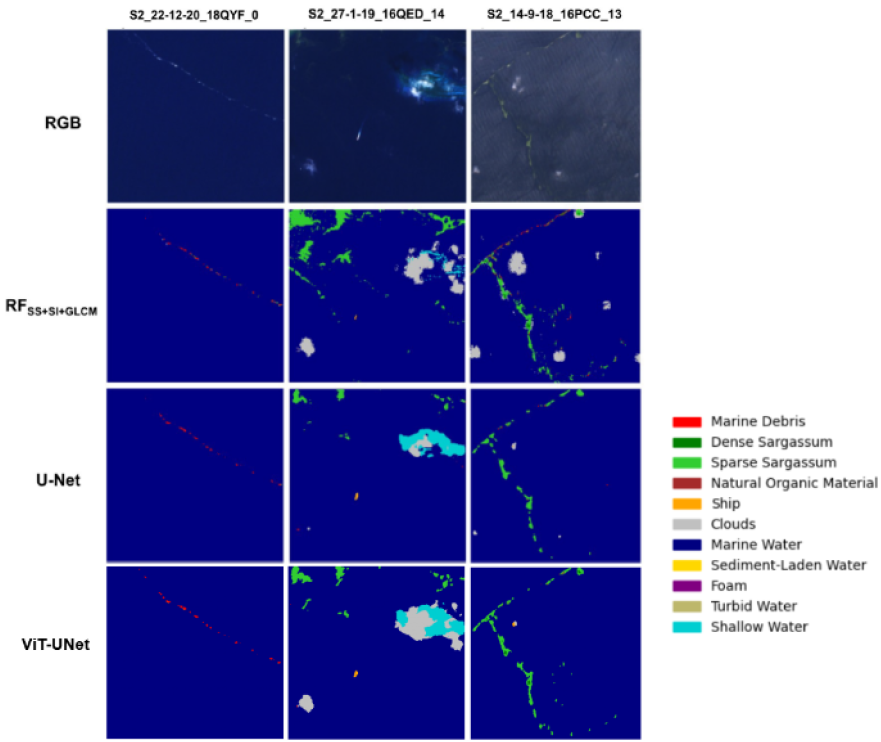

# ViT-UNet for Marine Debris Semantic Segmentation

**Pixel-level segmentation of ocean plastic on Sentinel-2 satellite imagery — a hybrid Vision Transformer + U-Net that beats the published [MARIDA](https://marine-debris.github.io/) Random Forest and U-Net baselines on average IoU, F1 and Pixel Accuracy.**

<!--
  HERO IMAGE — add assets/segmentation_comparison.png here (Figure 5 from the report):
  the RGB / RF / U-Net / ViT-UNet side-by-side masks. This is the single most important
  image; it shows the result at a glance. Export it at high resolution.
-->


---

## TL;DR

- **Goal:** detect floating marine plastic debris from space. Only ~1% of ocean plastic stays afloat, but that fraction is the part we can realistically detect and retrieve — and it's spectrally easy to confuse with foam, algae, ships, and clouds.
- **Approach:** an ImageNet-pretrained **ViT-B/16** encoder (86M params) fused with a **U-Net-style CNN decoder**, adapted from 3 RGB channels to **11 Sentinel-2 spectral bands** via *weight surgery* and *positional-embedding interpolation*.
- **Result:** outperforms both MARIDA baselines on **average** across all three metrics — **IoU 0.73** (vs 0.69 RF, 0.57 U-Net), **F1 0.83**, **Pixel Accuracy 0.83** on a held-out test set.
- **Honest finding:** on the *rarest* class (Marine Debris, ~0.41% of pixels) the transformer does **not** beat the Random Forest — a clean illustration of where data scarcity beats architectural sophistication. See [Limitations](#limitations--honest-findings).

---

## Headline Results

Average metrics across all 11 classes, held-out test set (best ViT-UNet model vs the two MARIDA baselines):

| Model | Mean IoU | Pixel Accuracy | Macro-F1 |
|---|:---:|:---:|:---:|
| MARIDA U-Net (baseline) | 0.57 | 0.69 | 0.69 |
| MARIDA Random Forest (SS+SI+GLCM, baseline) | 0.69 | 0.79 | 0.79 |
| **ViT-UNet (this work)** | **0.73** | **0.83** | **0.83** |

IoU (Jaccard / Intersection-over-Union) is the primary metric, as it penalises both over- and under-segmentation. Pixel Accuracy is reported for completeness but is unreliable here — water makes up >90% of pixels, so a trivial "predict water" model scores high.

<details>
<summary><b>Full per-class breakdown (click to expand)</b></summary>

IoU per class — **bold** = ViT-UNet wins or ties:

| Class | RF | U-Net | ViT-UNet |
|---|:---:|:---:|:---:|
| Marine Debris (MD) | **0.65** | 0.33 | 0.54 |
| Dense Sargassum | 0.87 | 0.60 | 0.83 |
| Sparse Sargassum | **0.83** | 0.66 | **0.83** |
| Natural Organic Material | 0.18 | 0.02 | **0.34** |
| Ship | **0.67** | 0.62 | 0.64 |
| Clouds | 0.84 | 0.62 | **0.88** |
| Marine Water | 0.75 | 0.61 | **0.77** |
| Sediment-Laden Water | 0.99 | 0.99 | **1.00** |
| Foam | 0.60 | 0.55 | **0.81** |
| Turbid Water | **0.88** | 0.84 | **0.88** |
| Shallow Water | 0.30 | 0.45 | **0.55** |
| **Average** | 0.69 | 0.57 | **0.73** |

The largest gains come on visually ambiguous classes (Foam +0.21, Natural Organic Material +0.16, Shallow Water +0.25 over RF), where the ViT's global self-attention helps disambiguate spectrally similar pixels.

</details>

<!--
  Optional second image — add assets/training_curves.png (Figure 3/4 from the report):
  the IoU/F1 evaluation curves and the aligned train/eval loss curves showing good
  generalisation. Nice-to-have, not essential.
-->

---

## Why this is non-trivial

Vision Transformers are built for 3-channel, 224×224 RGB images. Sentinel-2 gives you **11 spectral bands** at 256×256, and there are only **~700 training patches** — far too few to train a ViT from scratch without catastrophic overfitting. The interesting engineering is in bridging that gap while keeping the 86M pretrained parameters useful:

### 1. Weight surgery (3 → 11 channels)
The patch-embedding layer is rebuilt to accept 11 bands instead of 3. The three pretrained RGB filters are transplanted onto the matching Sentinel-2 bands (**B04/B03/B02 = R/G/B**), and the remaining eight spectral channels are randomly initialised — so the model starts from real visual priors instead of from noise.

### 2. Positional-embedding interpolation (14×14 → 16×16)
ViT-B/16 learned a 14×14 grid of positional embeddings on 224×224 images. At 256×256 the grid is 16×16, so the pretrained embeddings are bilinearly interpolated to cover the new positions — trading a little spatial precision to preserve the pretrained weights.

### 3. UNETR-inspired skip connections
ViT tokenisation discards pixel-level resolution, which is fatal for segmentation. Following the intuition of [UNETR](https://arxiv.org/abs/2103.10504), intermediate representations are pulled from transformer blocks **3, 6, 9 and 12** and fed into the CNN decoder via skip connections at multiple resolutions — recovering the fine spatial detail the encoder throws away.

### 4. Training choices that matter
- **Weighted cross-entropy** so the >90% water majority class doesn't dominate the loss.
- **AdamW** (not Adam) to match ViT's pretraining regime and regularise every parameter equally — Adam's coupled weight decay under-regularises high-gradient attention layers.
- **Stratified, representative** 50/25/25 splits (not random) so each split mirrors the full class distribution.
- Augmentation: random rotations and horizontal/vertical flips.

**Best config:** 60 epochs · batch size 16 · AdamW · weight decay 0.05 · LR 2e-4 → 2e-5 after epoch 40.

---

## Limitations & honest findings

The headline win is on the **average**. On the **Marine Debris class specifically** — the whole point of the dataset — the ViT-UNet (IoU 0.54) does **not** beat the Random Forest (0.65).

The diagnosis is the interesting part: Marine Debris is an extremely rare class (**3,339 pixels, ~0.41% of the dataset**). The Random Forest is handed hand-engineered features — spectral indices (NDWI, NDVI, FDI) and Gray-Level Co-occurrence texture statistics — that encode decades of remote-sensing domain knowledge. The transformer has to *learn* equivalent representations from data, and under this much scarcity it can't. **The takeaway: architectural sophistication alone can't replace domain priors when data is this thin.**

This is a feature of the writeup, not a thing to hide — knowing *why* a model underperforms is more valuable than a number that looks good.

### Where I'd take it next
- **Feature fusion:** concatenate the hand-engineered spectral/textural features with the learned deep representations — combine data-driven learning with domain priors instead of choosing one.
- **Domain-specific backbone:** swap the ImageNet ViT for a Sentinel-2 foundation model such as [Prithvi-EO-2.0](https://arxiv.org/abs/2412.02732), so the encoder starts with Earth-observation priors rather than natural-image ones.

---

## Repository structure

```
src/
  u-net-vit/         ViT-UNet model, training, evaluation, checkpoints
    vit-unet.py        architecture (encoder + decoder + skip connections)
    dataloader.py      11-band Sentinel-2 patch loading + augmentation
    train.py           training loop, W&B logging, checkpointing
    evaluation.py      test-set metrics + georeferenced mask export
  u-net-Baseline/    MARIDA U-Net baseline (for reference comparison)
  utils/             shared metrics, label/colour mappings, UNETR reference
notebooks/
  marida_runs.ipynb         training (Google Colab Pro)
  marida_runs2.ipynb        evaluation (Google Colab Pro)
  inference_notebook.ipynb  load checkpoint, run test set, render predictions
data/MARIDA/         dataset root — download separately (see Setup)
assets/              figures used in this README
outputs/             generated figures and prediction masks
```

> **Attribution:** This project builds directly on the MARIDA benchmark (Kikaki et al., 2022). The Random Forest and U-Net baselines, and the core structure of the training/evaluation loops, are adapted from the [original MARIDA repository](https://github.com/marine-debris/marine-debris.github.io) to keep results directly comparable. The ViT-UNet architecture, the channel/positional adaptations, and the comparative analysis are my own work.

---

## Setup

```bash
pip install -r requirements.txt
```

**1. Dataset** — download MARIDA from [Zenodo](https://zenodo.org/records/5151941) and place it under `data/MARIDA/`.

**2. Checkpoint** — download the trained ViT-UNet weights from [Hugging Face](https://huggingface.co/Brunaquen/MARIDA-ViT-UNet-Checkpoint/tree/main) and place under `src/u-net-vit/checkpoints/best_model/` (too large for GitHub).

## Usage

```bash
# Train (logs to Weights & Biases, writes checkpoints/)
python src/u-net-vit/train.py --data_path data/MARIDA/
#   run `python src/u-net-vit/train.py --help` for all tunable hyperparameters

# Evaluate on the test set + export georeferenced prediction masks (.tif)
python src/u-net-vit/evaluation.py --predict_masks True

# Visualise: open the exported masks in QGIS with the MARIDA palette,
# or run notebooks/inference_notebook.ipynb to render an RGB composite
# next to the predicted mask for any test patch.
```

---

## Tech stack

`Python` · `PyTorch` · `timm` (ViT backbones) · `Weights & Biases` · `Sentinel-2 / MARIDA` · `QGIS` (geospatial visualisation)

## Citation / dataset

> Kikaki K, Kakogeorgiou I, Mikeli P, Raitsos DE, Karantzalos K (2022). *MARIDA: A benchmark for Marine Debris detection from Sentinel-2 remote sensing data.* PLoS ONE 17(1): e0262247.

---

*Built as coursework for the MSc Artificial Intelligence (Deep Learning for Image Analysis, INM705) at City St George's, University of London.*
